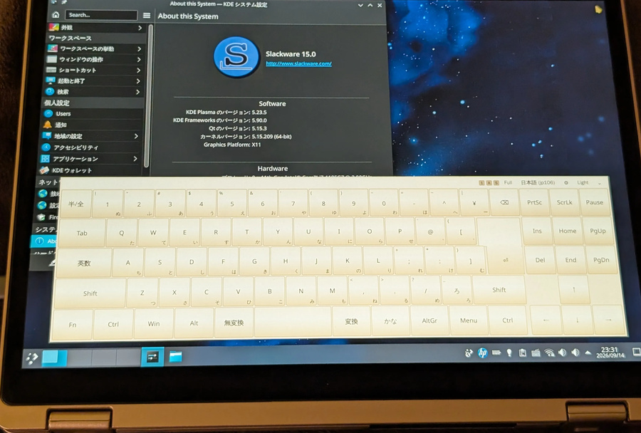
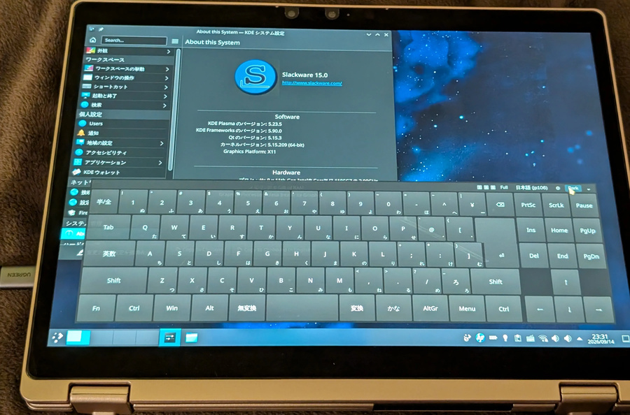

# tabletkeyboard

 

an on-screen keyboard for x11. keys are injected with xtest, so fcitx5, applications and shortcuts see ordinary key presses. runs as user withoutany special configuration. i made this with deepseek v4.1 flash (slopp ik ik but hopefully not too sloppy; i rly pushed it to clean up) 

## build

needs qt5 (core, gui, widgets, network), libxtst, cmake and a c++17 compiler; all part of slackware 15.0~

```sh
make
make install PREFIX=/usr
```

## run

```sh
tabletkeyboard  # tray only
tabletkeyboard --show
tabletkeyboard --toggle
tabletkeyboard --help
```

a second invocation forwards its arguments to the running instance!

## customise

layouts and themes are json:

*	~/.local/share/tabletkeyboard/layouts/*.json
*	~/.local/share/tabletkeyboard/themes/*.json

the package installs its copies in /usr/share/tabletkeyboard/ and reads those
too; a file with the same name in ~/.local/share wins. restart the keyboard to
pick up changes.

see [docs/layout.md](docs/layout.md) and [docs/theme.md](docs/theme.md)

```sh
tabletkeyboard --check-layout ./mylayout.json
tabletkeyboard --check-theme ./mytheme.json
```

everything else is in the tray menu, the settings dialog, or `~/.config/tabletkeyboard/tabletkeyboard.conf`.
